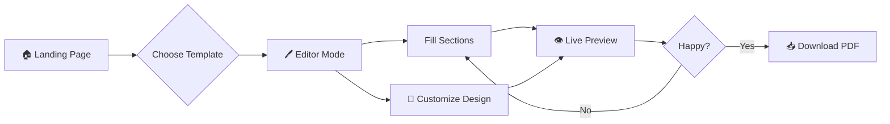

<div align="center">

# ✨ PURE CV Builder

### _The Purest Way to Build Your Professional CV_

[](https://purecvfrontend-production.up.railway.app)
[](https://pure-cv-builder-production.up.railway.app/health)

---


**A minimalist, precision-engineered CV builder for high-performing professionals.**

[🚀 Start Building](https://purecvfrontend-production.up.railway.app) • [📖 Documentation](https://docs.rendercv.com) • [💻 GitHub](https://github.com/baigcoder/pure-cv-builder)

</div>

---

## 🎯 Why Pure CV?

> *"No fluff, just precision-engineered templates that get you hired."*

Traditional CV builders are bloated with unnecessary features. **Pure CV** strips away the noise and focuses on what matters: creating professional, ATS-optimized CVs in minutes.

| Problem | Pure CV Solution |
|---------|------------------|
| 😤 Complex interfaces with 100+ options | ✅ Clean, focused editor with intuitive navigation |
| 😤 Generic templates that all look the same | ✅ 5 curated, research-backed professional themes |
| 😤 PDFs that fail ATS scanners | ✅ Typography-perfect, ATS-optimized output |
| 😤 No feedback on CV quality | ✅ Real-time ATS score & improvement tips |
| 😤 Hours spent on formatting | ✅ Live preview - see changes instantly |

---

## ✨ Core Features

### 📝 Smart CV Editor

<table>
<tr>
<td width="50%">

**Section-Based Navigation**
- 👤 Profile (Name, Headline, Contact, Summary)
- 💼 Work Experience
- 🎓 Education
- 🛠️ Skills
- 📁 Projects
- 📚 Publications
- 🏆 Awards & Certifications
- 📜 Patents
- 🎤 Talks & Presentations

</td>
<td width="50%">

**Intelligent Helpers**
- ✨ AI-powered content suggestions
- 📊 Real-time ATS score calculator
- 📈 Word count per section
- ✅ Section completion tracking
- 🔄 Auto-save with sync status
- ⚠️ Form validation with error hints

</td>
</tr>
</table>

---

### 🤖 AI-Powered Writing Assistant

Powered by advanced language models to help you craft compelling content:

| AI Feature | Description |
|------------|-------------|
| **✨ Headline Generator** | Creates impactful professional headlines based on your profile |
| **✨ Summary Polish** | Refines your professional summary for maximum impact |
| **✨ Experience Bullets** | Transforms basic job duties into achievement-focused bullets |
| **✨ Education Highlights** | Enhances academic achievements and coursework descriptions |
| **✨ Project Descriptions** | Improves project summaries with technical precision |
| **✨ Skills Suggestions** | Recommends relevant skills based on your experience |
| **✨ Honor Formatting** | Properly formats awards and certifications |

---

### 🎨 Professional Theme Gallery

Choose from 5 meticulously designed templates:

| Theme | Style | Best For |
|-------|-------|----------|
| **Classic Professional** | Traditional, formal | Corporate roles, Banking, Law |
| **Modern Minimal** | Two-column, clean | Design, Marketing, Tech startups |
| **Academic Focus** | Detailed, research-oriented | PhD, Research, Academia |
| **Technical Precision** | Skills-first, hierarchical | Engineering, Software, DevOps |
| **Entry Level** | Education-first, potential-focused | Students, Fresh graduates, Career changers |

Each theme features:
- ✅ ATS-optimized typography
- ✅ Professional color schemes
- ✅ Perfect spacing & alignment
- ✅ LaTeX-quality PDF output

---

### 🎛️ Design Customization

Personalize your CV while maintaining professional standards:

```
🎨 Colors
├── 10 curated color presets (Classic Blue, Modern Indigo, Elegant Teal, etc.)
├── Custom hex color picker
└── Consistent application across headings & links

🔤 Typography  
├── 7 professional font families
├── Source Sans 3 (default)
├── Inter, Roboto, Open Sans, Lato
└── Georgia, Times New Roman (traditional)

📐 Layout
├── US Letter / A4 page sizes
├── Adjustable margins
└── Section ordering by theme
```

---

### 📊 ATS Score Calculator

Real-time optimization feedback with actionable tips:

```
┌─────────────────────────────────────────┐
│         ATS Strength: 85%               │
├─────────────────────────────────────────┤
│ ✅ Contact info complete (+20 pts)      │
│ ✅ Summary 50+ characters (+15 pts)     │
│ ✅ Work experience with bullets (+25)   │
│ ✅ Education section filled (+15 pts)   │
│ ✅ Skills section present (+15 pts)     │
│ ⚠️ Aim for 300-700 total words (+10)   │
└─────────────────────────────────────────┘
```

---

### ⚡ Real-Time Preview

- **Instant Updates**: See your CV update as you type (1.5s debounce)
- **Full-Page Preview**: High-resolution PNG rendering
- **Sync Status**: Visual indicator shows save state
- **Error Feedback**: Field-level validation messages

---

### 📤 Export Options

| Format | Use Case | Quality |
|--------|----------|---------|
| **PDF** | Job applications, printing | LaTeX-quality, vector graphics |
| **PNG** | Quick preview, sharing | High-resolution image |
| **YAML** | Version control, CLI usage | Structured data format |

---

## 🏗️ Technical Architecture

```
pure-cv-builder/
│
├── 🎨 frontend/                    # Next.js 15 + React 19
│   ├── src/
│   │   ├── app/
│   │   │   ├── page.tsx           # Landing page with template gallery
│   │   │   └── editor/
│   │   │       ├── page.tsx       # Main CV editor (1600+ lines)
│   │   │       └── editor.module.css
│   │   └── components/
│   │       └── Brand.tsx          # Logo & icons
│   ├── public/                    # Theme preview images
│   └── package.json
│
├── ⚙️ backend/                     # FastAPI + Python 3.12
│   ├── main.py                    # CORS, routing, health checks
│   ├── api/
│   │   └── render.py              # REST endpoints (render, preview, AI)
│   └── services/
│       ├── cv_service.py          # RenderCV integration
│       └── ai_service.py          # GPT-powered suggestions
│
└── 📦 docker-compose.yml          # Local development setup
```

---

## 🚀 Live Deployment

| Service | Platform | URL | Status |
|---------|----------|-----|--------|
| **Frontend** | Railway | [purecvfrontend-production.up.railway.app](https://purecvfrontend-production.up.railway.app) | 🟢 Live |
| **Backend** | Railway | [pure-cv-builder-production.up.railway.app](https://pure-cv-builder-production.up.railway.app) | 🟢 Live |

### API Endpoints

```http
# Health Check
GET /health
GET /api/health

# CV Operations
POST /api/preview     → PNG preview
POST /api/download    → PDF download
POST /api/render      → PNG or PDF (by format param)
POST /api/yaml        → YAML export

# AI Suggestions
POST /api/ai/suggest  → AI-powered content improvements

# Theme Info
GET /api/themes       → Available themes list
```

---

## 🔧 Local Development

### Prerequisites
- Node.js 18+
- Python 3.12+
- Docker (optional)

### Quick Start

```bash
# Clone the repository
git clone https://github.com/baigcoder/pure-cv-builder.git
cd pure-cv-builder

# Start with Docker
docker-compose up -d

# Or manually:

# Backend
cd backend
pip install -r requirements.txt
uvicorn main:app --reload --port 8000

# Frontend (new terminal)
cd frontend
npm install
npm run dev
```

### Environment Variables

| Variable | Service | Description |
|----------|---------|-------------|
| `NEXT_PUBLIC_API_URL` | Frontend | Backend API URL |
| `CORS_ORIGINS` | Backend | Comma-separated allowed origins |
| `LOG_LEVEL` | Backend | Logging verbosity (INFO, DEBUG) |
| `OPENAI_API_KEY` | Backend | For AI suggestions (optional) |

---

## 📱 User Workflow



**Step-by-Step:**
1. **Landing Page** → Click "Start Drafting"
2. **Template Selection** → Choose from 5 professional themes
3. **Editor** → Fill in sections (Profile, Experience, Education, etc.)
4. **AI Assist** → Use ✨ buttons for content suggestions
5. **Preview** → Watch your CV update in real-time
6. **Optimize** → Check ATS score and apply tips
7. **Download** → Export as PDF for job applications

---

## 🎯 Key Differentiators

| Feature | Pure CV | Traditional Builders |
|---------|---------|---------------------|
| **Technology** | LaTeX-powered (perfect typography) | HTML/CSS (inconsistent) |
| **AI Integration** | Built-in GPT suggestions | None or premium-only |
| **ATS Optimization** | Real-time score calculator | Manual guesswork |
| **Open Source** | MIT License, fully transparent | Closed source |
| **Speed** | ~1.5s live preview | Page reload required |
| **Price** | 100% Free | $10-30/month |

---

## 📄 License

MIT License - Free for personal and commercial use.

---

<div align="center">

### 🌟 Ready to Build Your Perfect CV?

[](https://purecvfrontend-production.up.railway.app)

**Built with ❤️ for professionals who value their time**

*Powered by [RenderCV](https://github.com/rendercv/rendercv) • Deployed on [Railway](https://railway.app)*

</div>
